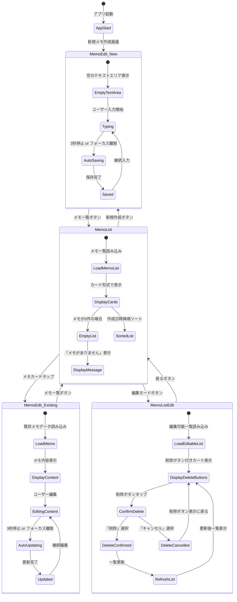
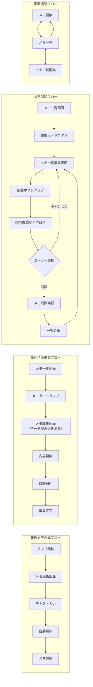
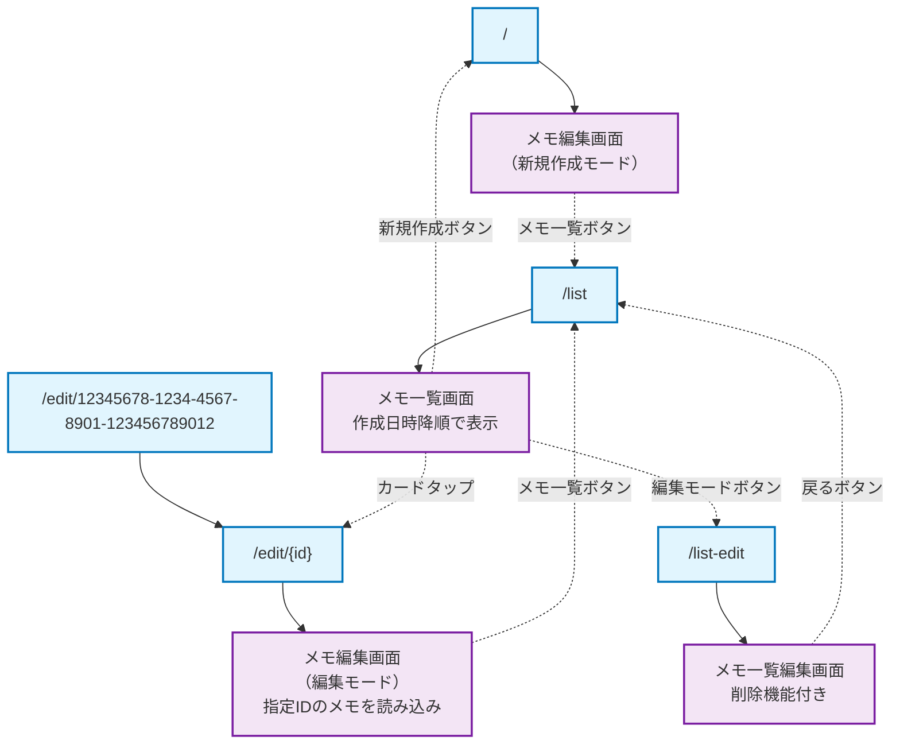
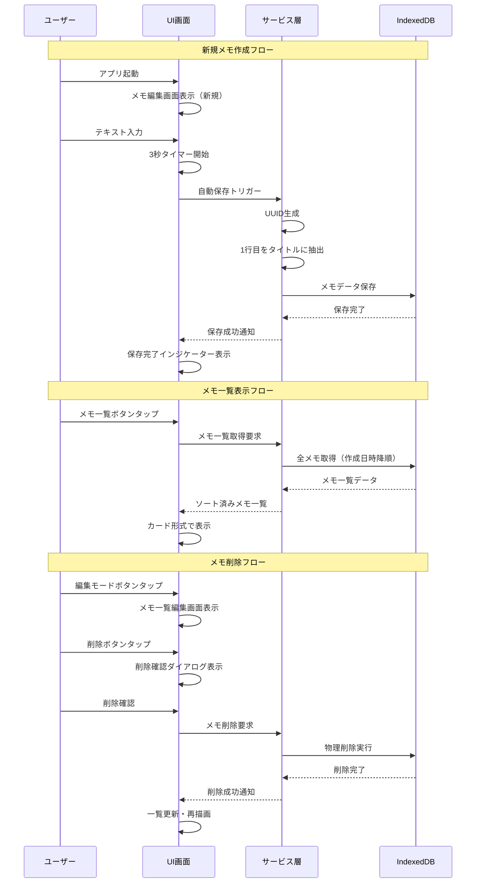
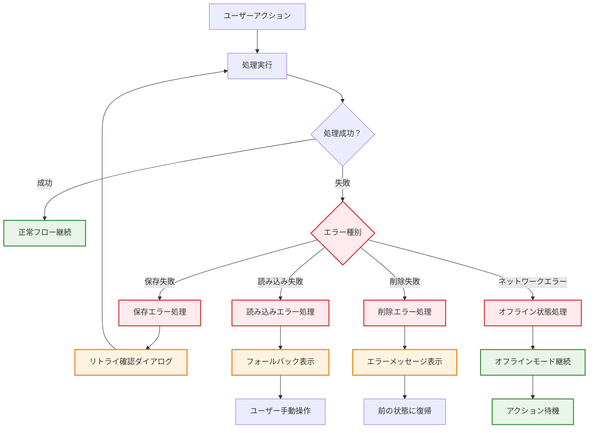

# ai-MyNotes 画面遷移図

## 基本画面遷移フロー

```mermaid
graph TD
    Start([アプリ起動]) --> MemoEdit
    
    MemoEdit["メモ編集画面<br/>（/ または /edit/{id}）<br/>・メモ本文入力<br/>・リアルタイム保存<br/>・1行目がタイトル"]
    
    MemoList["メモ一覧画面<br/>（/list）<br/>・メモカード一覧表示<br/>・作成日時降順ソート<br/>・タップで編集"]
    
    MemoListEdit["メモ一覧編集画面<br/>（/list-edit）<br/>・削除ボタン付きカード<br/>・削除確認ダイアログ<br/>・物理削除"]
    
    ConfirmDialog["削除確認ダイアログ<br/>・メモタイトル表示<br/>・キャンセル/削除選択"]
    
    %% 基本遷移
    MemoEdit --|📝 メモ一覧ボタン| MemoList
    MemoList --|✏️ 新規作成ボタン| MemoEdit
    MemoList --|メモカードタップ<br/>（編集）| MemoEdit
    MemoList --|🗂️ 編集モードボタン| MemoListEdit
    MemoListEdit --|← 戻るボタン| MemoList
    
    %% 削除フロー
    MemoListEdit --|×削除ボタン| ConfirmDialog
    ConfirmDialog --|キャンセル| MemoListEdit
    ConfirmDialog --|削除実行| MemoListEdit
    
    %% スタイリング
    classDef primary fill:#e3f2fd,stroke:#1976d2,stroke-width:2px
    classDef secondary fill:#f3e5f5,stroke:#7b1fa2,stroke-width:2px
    classDef warning fill:#fff3e0,stroke:#f57c00,stroke-width:2px
    classDef start fill:#e8f5e8,stroke:#388e3c,stroke-width:2px
    
    class MemoEdit primary
    class MemoList secondary
    class MemoListEdit secondary
    class ConfirmDialog warning
    class Start start
```

## 詳細画面遷移パターン



## ユーザーアクション別フロー



## URL ルーティング仕様



## 状態管理とデータフロー



## エラーハンドリングフロー

