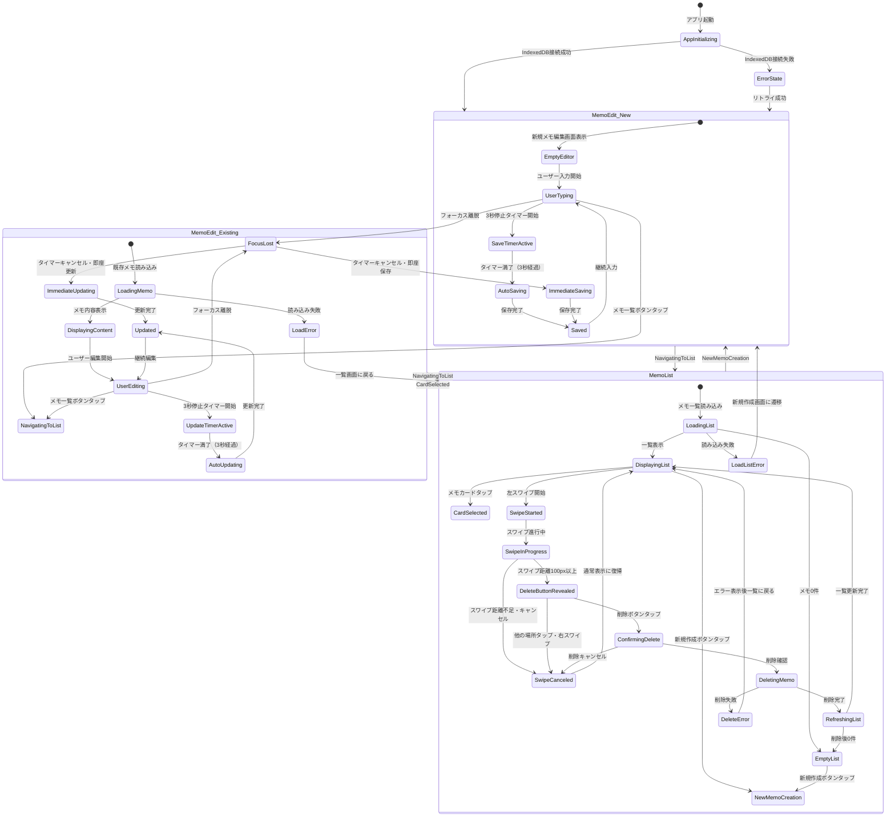
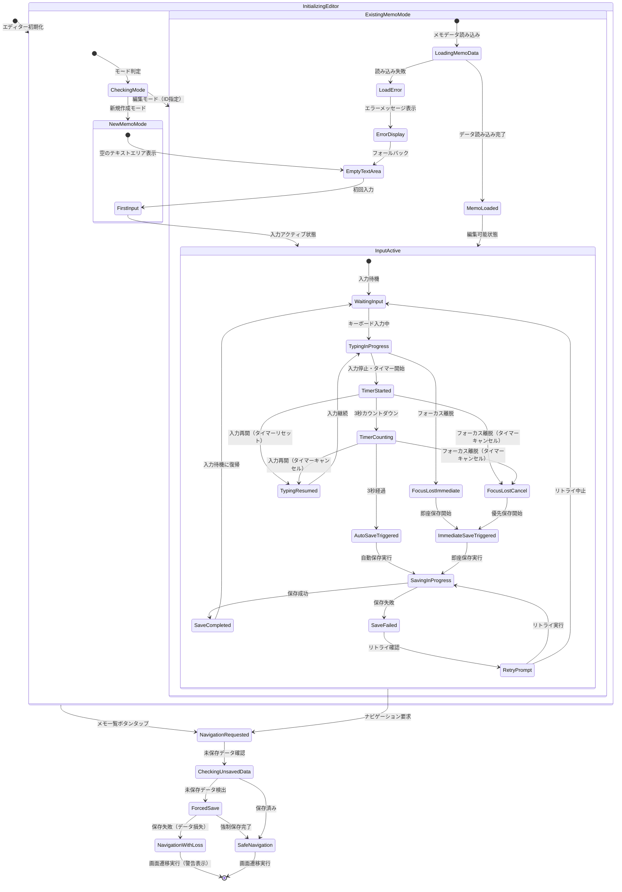
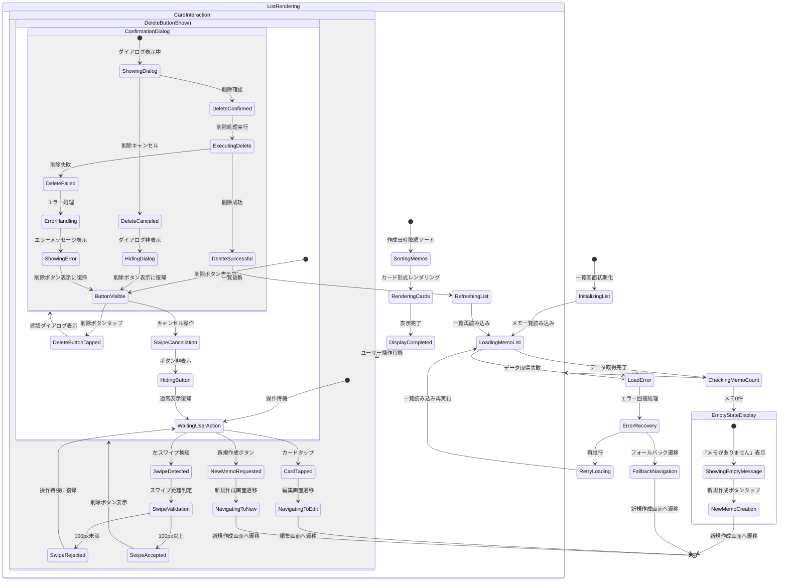
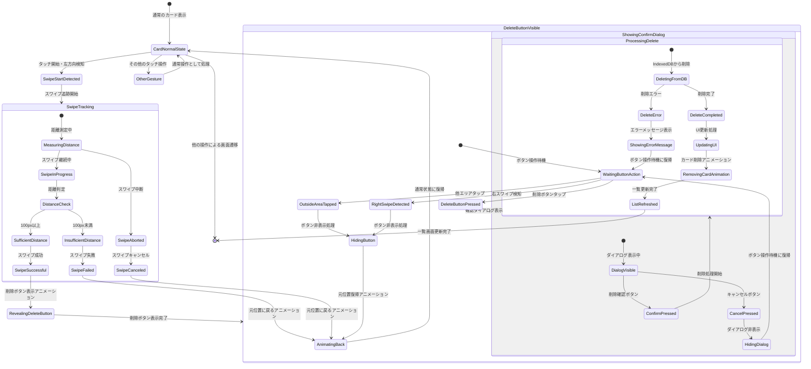
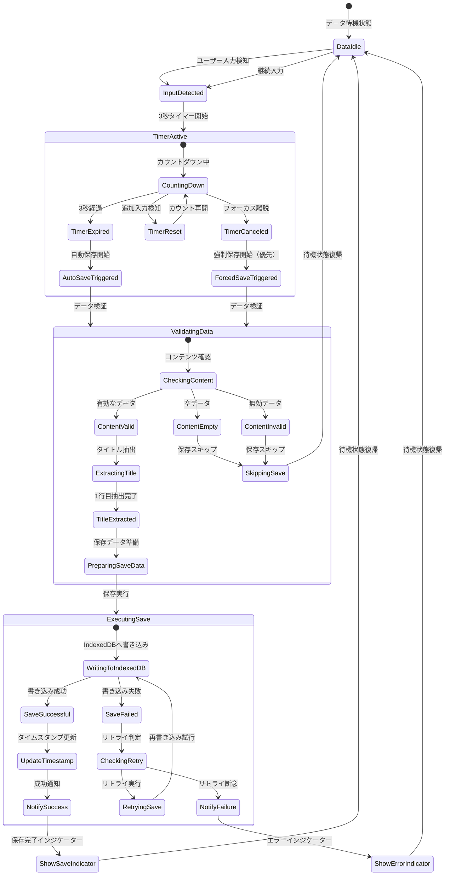

# ai-MyNotes 状態遷移図

## アプリケーション全体状態遷移

## メモ編集画面の詳細状態遷移

## メモ一覧画面の詳細状態遷移

## 左スワイプ削除の詳細状態遷移

## データ保存状態遷移（リアルタイム保存）

## エラー状態遷移

```mermaid
stateDiagram-v2
    [*] --> NormalOperation : 正常動作
    
    NormalOperation --> ErrorDetected : エラー発生
    
    state ErrorDetected {
        [*] --> ErrorClassification : エラー分類
        ErrorClassification --> DatabaseError : DB接続・操作エラー
        ErrorClassification --> NetworkError : ネットワークエラー
        ErrorClassification --> UIError : UI操作エラー
        ErrorClassification --> ValidationError : データ検証エラー
        ErrorClassification --> SwipeError : スワイプ操作エラー
    }
    
    state DatabaseError {
        [*] --> DBConnectionFailed : DB接続失敗
        [*] --> DBWriteFailed : DB書き込み失敗
        [*] --> DBReadFailed : DB読み込み失敗
        [*] --> DBDeleteFailed : DB削除失敗
        
        DBConnectionFailed --> RetryConnection : 接続リトライ
        DBWriteFailed --> RetrySave : 保存リトライ
        DBReadFailed --> FallbackDisplay : フォールバック表示
        DBDeleteFailed --> RetryDelete : 削除リトライ
        
        RetryConnection --> ConnectionRestored : 接続復旧
        RetryConnection --> PermanentFailure : 恒久的失敗
        
        RetrySave --> SaveRestored : 保存復旧
        RetrySave --> SaveAbandoned : 保存断念
        
        RetryDelete --> DeleteRestored : 削除復旧  
        RetryDelete --> DeleteAbandoned : 削除断念
    }
    
    state NetworkError {
        [*] --> OfflineDetected : オフライン検知
        OfflineDetected --> OfflineMode : オフラインモード移行
        OfflineMode --> OnlineRestored : オンライン復旧
        OfflineMode --> ContinueOffline : オフライン継続
    }
    
    state UIError {
        [*] --> RenderingError : レンダリングエラー
        [*] --> NavigationError : 画面遷移エラー
        [*] --> InputError : 入力処理エラー
        
        RenderingError --> RefreshUI : UI再描画
        NavigationError --> FallbackRoute : フォールバックルート
        InputError --> ResetInput : 入力リセット
    }
    
    state ValidationError {
        [*] --> InvalidInput : 無効入力
        [*] --> DataCorruption : データ破損
        
        InvalidInput --> ShowValidationMessage : 検証メッセージ表示
        DataCorruption --> DataRecovery : データ回復処理
    }
    
    state SwipeError {
        [*] --> SwipeDetectionFailed : スワイプ検知失敗
        [*] --> SwipeAnimationError : アニメーションエラー
        
        SwipeDetectionFailed --> FallbackToButton : ボタン操作フォールバック
        SwipeAnimationError --> SkipAnimation : アニメーションスキップ
    }
    
    %% 復旧処理
    ConnectionRestored --> NormalOperation
    SaveRestored --> NormalOperation
    DeleteRestored --> NormalOperation
    OnlineRestored --> NormalOperation
    RefreshUI --> NormalOperation
    FallbackRoute --> NormalOperation
    ResetInput --> NormalOperation
    ShowValidationMessage --> NormalOperation
    FallbackToButton --> NormalOperation
    SkipAnimation --> NormalOperation
    
    %% 恒久的失敗処理
    PermanentFailure --> GracefulDegradation : 機能縮退
    SaveAbandoned --> DataLossWarning : データ損失警告
    DeleteAbandoned --> OperationFailed : 操作失敗通知
    ContinueOffline --> OfflineNotification : オフライン通知
    DataRecovery --> NormalOperation
    
    GracefulDegradation --> NormalOperation : 縮退モードで継続
    DataLossWarning --> NormalOperation : 警告後継続
    OperationFailed --> NormalOperation : 失敗通知後継続
    OfflineNotification --> NormalOperation : 通知後継続
```

---

## 状態遷移設計のポイント

### 1. リアルタイム保存の優先制御
- **フォーカス離脱優先**: テキストエリアからフォーカスが外れた際は、3秒タイマーをキャンセルして即座に保存
- **タイマーリセット**: 継続入力時は既存タイマーをキャンセルし、新しい3秒タイマーを開始
- **保存状態の明確化**: 保存中・保存完了・保存失敗の各状態を明確に分離

### 2. 左スワイプ削除の精密制御
- **距離判定**: 100px以上のスワイプで削除ボタン表示
- **キャンセル機能**: スワイプ途中でのキャンセル、他エリアタップでのキャンセル
- **確認プロセス**: 削除ボタンタップ後の確認ダイアログによる安全性確保

### 3. エラーハンドリングの網羅
- **分類別処理**: DB・ネットワーク・UI・バリデーション・スワイプの各エラーを個別処理
- **復旧戦略**: リトライ・フォールバック・縮退モードによる段階的復旧
- **ユーザビリティ**: エラー時でも基本機能を継続可能な設計

### 4. 2画面構成の最適化
- **シンプルな遷移**: メモ編集 ↔ メモ一覧の直接的な遷移
- **状態保持**: 各画面の状態を適切に管理し、遷移時のデータ整合性を確保
- **レスポンシブ対応**: iOS Chrome環境での最適な動作を保証

この状態遷移図により、ai-MyNotesアプリの全ての動作パターンと例外処理が明確に定義され、開発時の実装指針として活用できます。