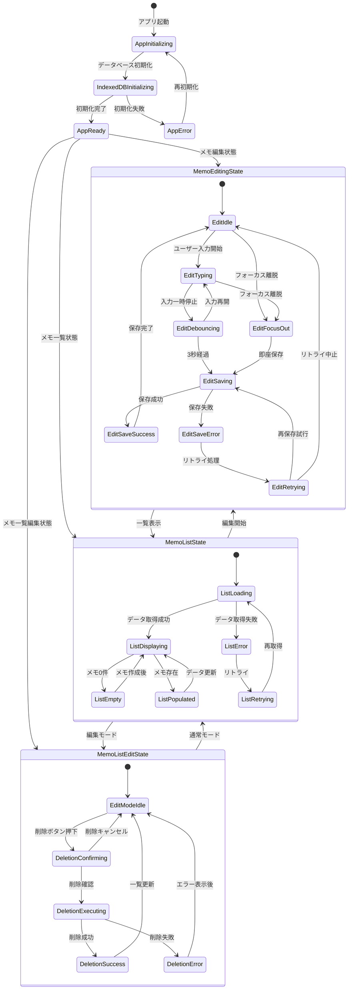
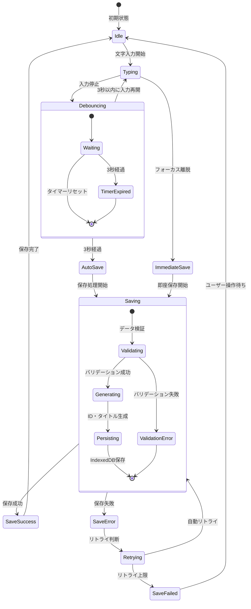
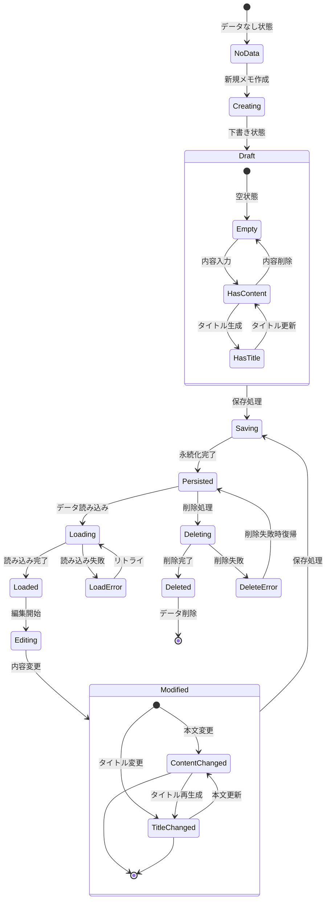
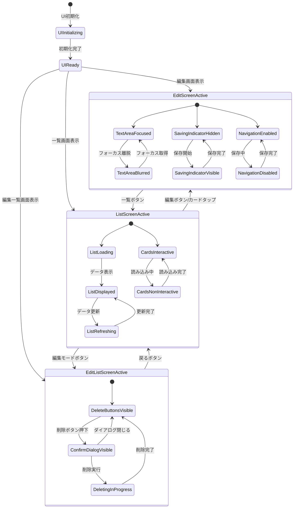
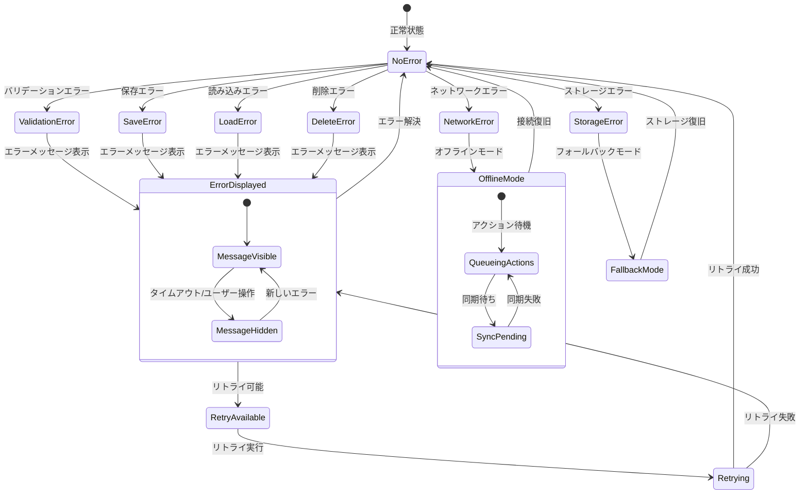

# ai-MyNotes アプリケーション状態遷移図

## 1. 全体状態遷移

## 2. リアルタイム保存状態遷移

## 3. データ状態遷移

## 4. UI状態遷移

## 5. エラー状態遷移

## 状態管理実装の考慮事項

### 1. 状態の持続性
- **一時的状態**: UI表示状態、入力中フラグ等
- **永続的状態**: メモデータ、ユーザー設定等
- **セッション状態**: 編集中メモID、画面履歴等

### 2. 状態遷移のトリガー
- **ユーザーアクション**: ボタンクリック、テキスト入力、フォーカス変更
- **システムイベント**: タイマー満了、保存完了、エラー発生
- **外部イベント**: ネットワーク状態変化、ストレージ容量変化

### 3. 並行状態の管理
- **リアルタイム保存**: バックグラウンドで実行
- **UI操作**: ユーザーインタラクションを並行処理
- **エラーハンドリング**: 他の処理と独立して実行

### 4. 状態の一貫性
- **データ整合性**: メモリ内データとIndexedDBの同期
- **UI整合性**: 表示データと実際のデータの同期
- **状態復旧**: アプリ再起動時の状態復元

### 5. パフォーマンス考慮
- **状態更新の最適化**: 不要な再描画を避ける
- **メモリ管理**: 大量メモ時の効率的な状態管理
- **非同期処理**: UI応答性を維持した状態遷移

### 6. デバッグ・テスト
- **状態ログ**: 状態遷移の追跡とデバッグ
- **状態モック**: テスト用の状態シミュレーション
- **状態検証**: 期待する状態遷移の自動テスト