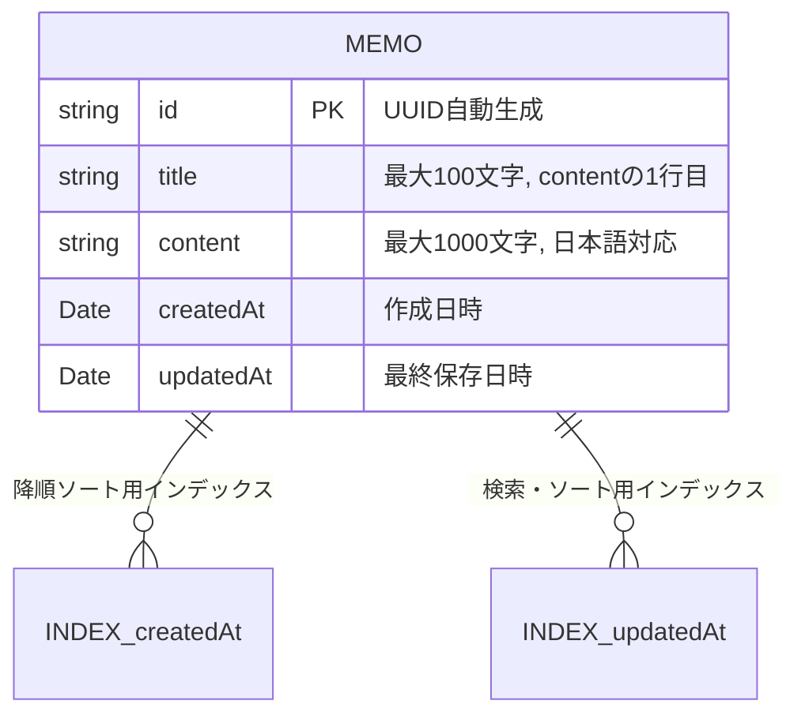
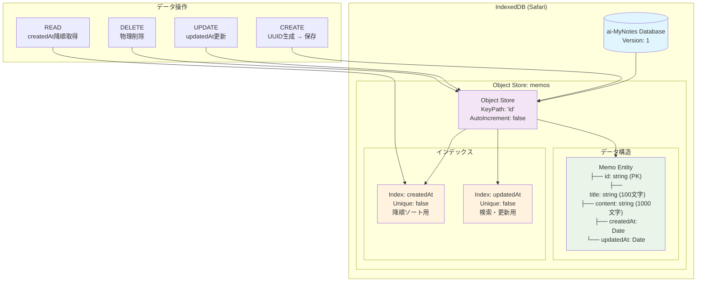

# メモデータ データベース

## データベース: Safari IndexedDB

## データ構造

```json
{
    id: string,
    title: string,
    content: string,
    createdAt: Date,
    updatedAt: Date
}
```

## データ項目

- id: string
    - 最初の保存時に自動生成されるUUID 
- title: string
    - メモのタイトル
    - 最大文字数: 100文字
    - 日本語対応
    - contentの1行目
- content: string
    - メモ本文
    - 最大文字数: 1000文字
    - 日本語対応
- createdAt: Date
    - メモの作成日時
- updatedAt: Date
    - メモの最終保存日時

## データモデル


## データ操作


## バリデーション規則

  1. IDフィールド (id: string)

  必須チェック
  - 空文字列・null・undefined不可
  - UUID形式の検証（36文字、ハイフン含む）

  形式チェック
  ^[0-9a-f]{8}-[0-9a-f]{4}-4[0-9a-f]{3}-[89ab][0-9a-f]{3}-[0-9a-f]{12}$

  2. タイトルフィールド (title: string)

  必須チェック
  - 空文字列は許可（contentの1行目から自動生成）
  - null・undefined不可

  文字数制限
  - 最大100文字
  - 日本語文字を考慮したUnicode文字数カウント

  文字種制御
  - 制御文字（\n, \r, \t等）の除去
  - 先頭・末尾の空白文字トリム

  3. 本文フィールド (content: string)

  必須チェック
  - 空文字列は許可
  - null・undefined不可

  文字数制限
  - 最大1000文字
  - 日本語文字を考慮したUnicode文字数カウント

  文字種制御
  - タブ文字は4スペースに変換
  - 連続する改行は2つまでに制限

  4. 作成日時 (createdAt: Date)

  必須チェック
  - null・undefined不可
  - 有効なDateオブジェクトであること

  値域チェック
  - 1900年1月1日以降
  - 現在時刻以降は不可（未来日時不可）

  5. 更新日時 (updatedAt: Date)

  必須チェック
  - null・undefined不可
  - 有効なDateオブジェクトであること

  値域チェック
  - createdAt以降の日時であること
  - 現在時刻以降は不可（未来日時不可）

  実装上の考慮事項

  データ保存時の自動処理

  1. titleの自動生成: contentが存在する場合、contentの1行目を抽出してtitleに設定
        titleが存在する場合、contentの1行目を抽出してtitleを更新
  2. 日時の自動設定: 新規作成時にcreatedAt・updatedAtを現在時刻に設定
  3. UUIDの自動生成: 新規作成時にIDを自動生成

  エラーハンドリング

  - バリデーションエラー時は具体的なエラーメッセージを返す
  - 複数エラーが発生した場合は配列で全てのエラーを返す
  - ユーザーフレンドリーなメッセージに変換

  パフォーマンス最適化

  - 文字数カウントはリアルタイムで実行しない（保存時のみ）
  - 重い正規表現チェックは最小限に抑制