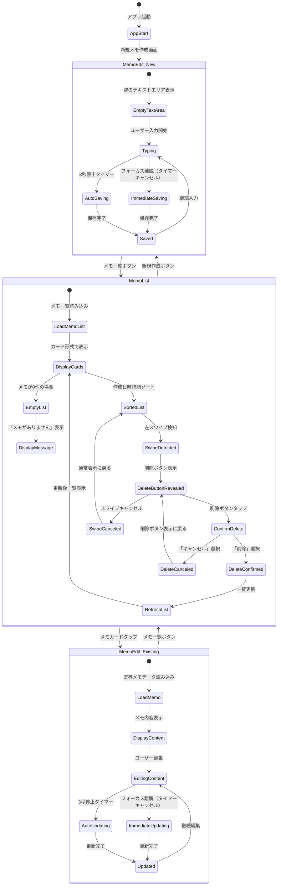
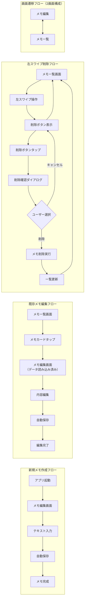
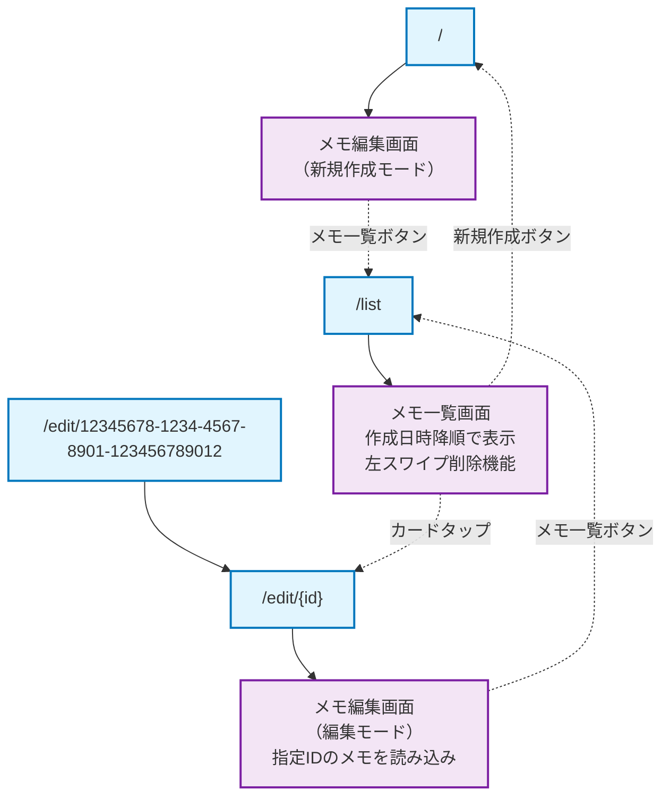
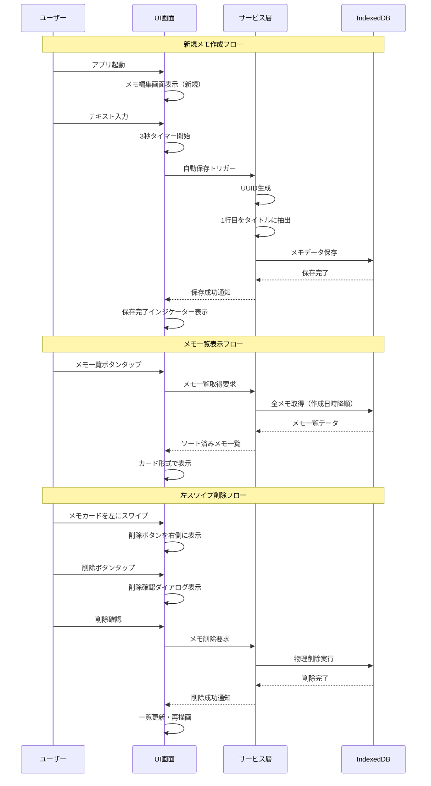
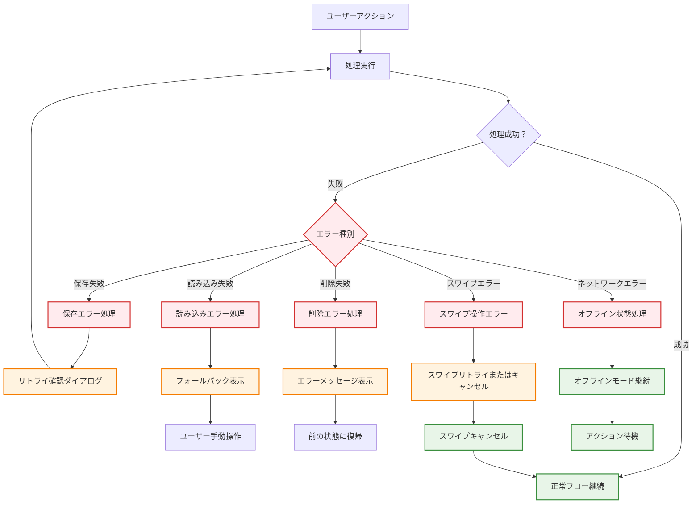
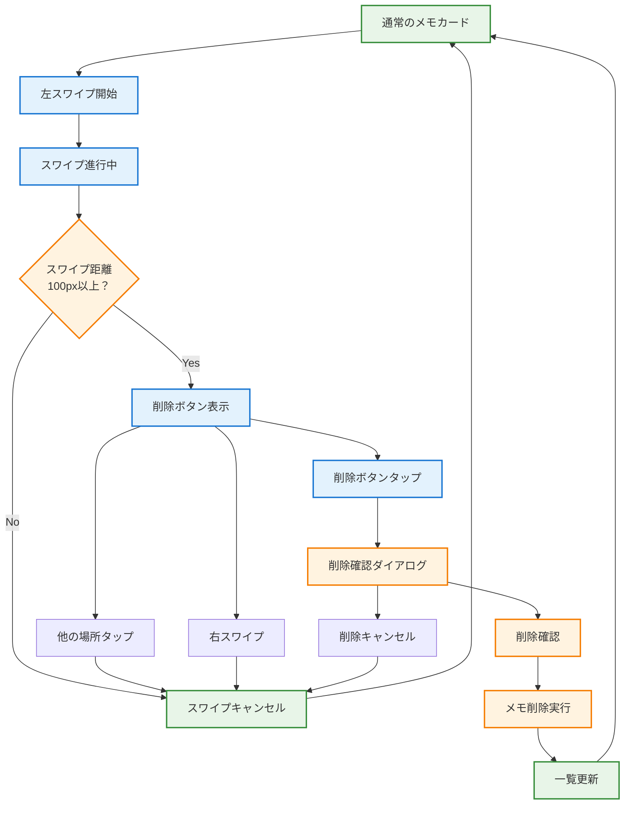

# ai-MyNotes 画面遷移図（2画面構成）

## 基本画面遷移フロー

```mermaid
graph TD
    Start([アプリ起動]) --> MemoEdit
    
    MemoEdit["メモ編集画面<br/>（/ または /edit/{id}）<br/>・メモ本文入力<br/>・リアルタイム保存<br/>・1行目がタイトル"]
    
    MemoList["メモ一覧画面<br/>（/list）<br/>・メモカード一覧表示<br/>・作成日時降順ソート<br/>・タップで編集<br/>・左スワイプで削除"]
    
    ConfirmDialog["削除確認ダイアログ<br/>・メモタイトル表示<br/>・キャンセル/削除選択"]
    
    %% 基本遷移（2画面構成）
    MemoEdit --|📝 メモ一覧ボタン| MemoList
    MemoList --|✏️ 新規作成ボタン| MemoEdit
    MemoList --|メモカードタップ<br/>（編集）| MemoEdit
    
    %% 左スワイプ削除フロー
    MemoList --|左スワイプ| ConfirmDialog
    ConfirmDialog --|キャンセル| MemoList
    ConfirmDialog --|削除実行| MemoList
    
    %% スタイリング
    classDef primary fill:#e3f2fd,stroke:#1976d2,stroke-width:2px
    classDef secondary fill:#f3e5f5,stroke:#7b1fa2,stroke-width:2px
    classDef warning fill:#fff3e0,stroke:#f57c00,stroke-width:2px
    classDef start fill:#e8f5e8,stroke:#388e3c,stroke-width:2px
    
    class MemoEdit primary
    class MemoList secondary
    class ConfirmDialog warning
    class Start start
```

## 詳細画面遷移パターン



## ユーザーアクション別フロー



## URL ルーティング仕様（2画面構成）



## 状態管理とデータフロー



## エラーハンドリングフロー



## 左スワイプ削除の詳細動作



---

## 設計の特徴

### 1. シンプルな2画面構成
- メモ編集画面 ↔ メモ一覧画面
- 複雑な画面遷移を排除
- ユーザーの認知負荷を軽減

### 2. 直感的な削除操作
- iOS標準的な左スワイプ削除
- 削除確認ダイアログによる安全性
- 物理削除による確実なデータ削除

### 3. リアルタイム保存
- フォーカス離脱優先のタイマー制御
- 3秒停止での自動保存
- データ損失リスクの最小化

### 4. レスポンシブな状態管理
- 各画面の独立した状態管理
- エラーハンドリングの充実
- オフライン対応の考慮